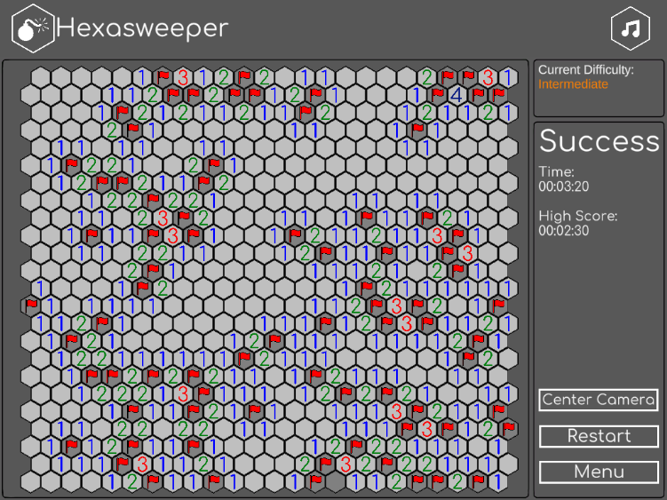

#  Hexagonal MineSweeper
 
## Controls
Zoom with the scroll wheel or the + and - keys.  
Move the board with the arrows or the WASD keys.  
Left clicking on tiles reveals whats under them.  
Right clicking on tiles sets flags on them.  
Middle clicking (clicking on the scroll wheel) on a tile with the same amount of adjacent flags as bombs nearby will reveal all tiles near it that aren't flagged. Including bombs if the adjacent flags were placed incorrectly.

## Rules:
The goal of Minesweeper is to uncover all the tiles on a grid that do not contain mines without being "blown up" by clicking on a tile with a mine underneath.  
Bombs:  

  
Example of a won game:  
  
The location of most mines is discovered through a logical process, but some require guessing, usually with a 50-50 chance of being correct.

Clicking on a tile will reveal what is hidden underneath it. If a tile has no bombs near it (marked as a tile without a number when revealed) all adjacent tiles to it will also automatically be revealed. This can trigger a chain reaction of empty tiles that are being revealed together.
other tiles contain numbers (from 1 to 6), with each number being the number of mines adjacent to the uncovered tile.  

  

To help the player avoid hitting a mine, the location of a suspected mine can be marked by flagging it with the right mouse button.  
  
The game is won once all blank or numbered squares have been uncovered by the player and all mines were flagged.

The game board comes in three set sizes with a predetermined number of mines: "beginner", "intermediate", and "expert".

Note: If you have no access to a proper mouse, clicking on the logo in the screen of the game would allow every button to function like a middle button when clicking on a revealed tile.